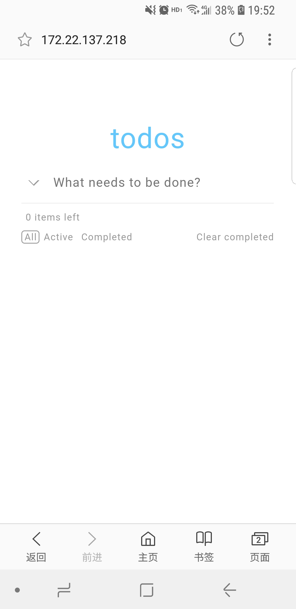
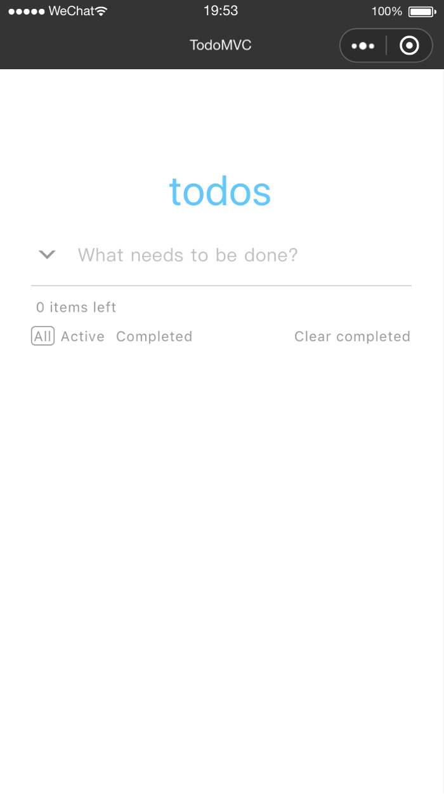
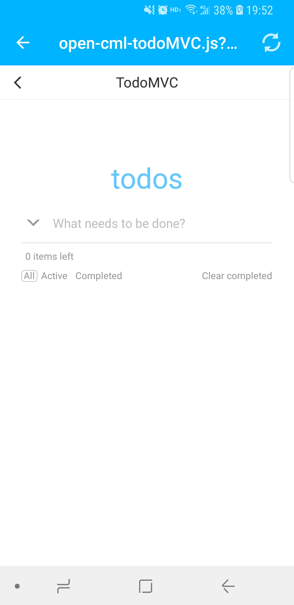

# cml-todomvc
本仓库基于 `cml` 框架开发的跨端demo ———— TODO LIST

### 如何开发
```javascript
npm install
cml dev  //开始开发
```

 ### 多端预览效果
| web   |      微信小程序      |  native-weex |
|:----------:|:-------------:|:------:|
|  |  |  |

